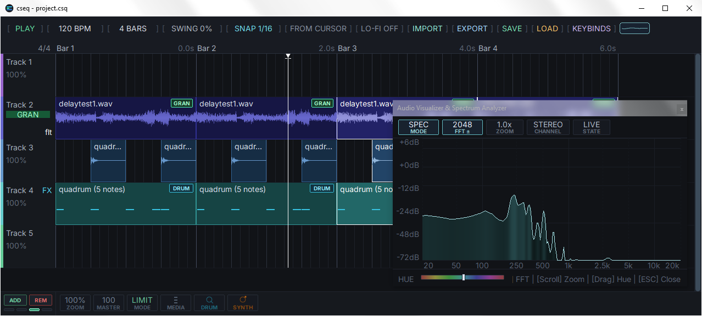

  

<h2 align="center">cseq</h2>

  multitrack sampler sequencer workstation (C99/Win32)

---

  

---

### media

| Component | Description |
| :--- | :--- |
| **Audio Input** | `WAV`, `MP3`, `FLAC`, `OGG`, `OPUS`, `M4A`, `AIFF`; SoundFont 2 (`.sf2`) banks |
| **Audio Output** | `44.1 kHz` `Stereo` WASAPI mixdown; `WAV` export (16‑bit & 24‑bit TPDF dithered, 32‑bit float) |

---

### controls

| Component | Description |
| :--- | :--- |
| **Keybinds Reference** | Press `K` or click the `[KEYBINDS]` toolbar button to open a searchable keyboard shortcut window |
| **Timeline Canvas** | Click to select; drag to move. Drag edges to **trim**; hold `Alt` while dragging to **slip‑edit** internal sample offset. Drag top corner handles to adjust **fade‑in/out** length. Marquee select across clips; `Ctrl+Drag` to **duplicate** in place; `Shift+Drag` an edge to stretch playback rate with boundary resizing. Right‑click for context menus (rate, slice, reverse, fades, granular) |
| **Track Headers** | Click track name/number to toggle **mute**; click solo to isolate. `Shift+Drag` vertically to **reorder** tracks. Hover and scroll wheel to adjust track volume. Right‑click to open dedicated dialogs (Pan/Width, 3‑Band EQ, Filter Plotter) |
| **Piano Roll** | Click grid to add a note (snaps to clicked cell); double‑click or right‑click to delete. Drag to move; drag right edge to resize duration. Hover note and use mouse wheel to set **velocity** (0–127). ADSR knobs respond to drag and hover scroll. Octave button supports click and scroll wheel (-3 to +3 octaves). QWERTY keys audition notes polyphonically with physical key-tracking |
| **Media Explorer** | File and folder browser with background metadata decoding. Audition preview features ping‑pong memory buffers, 0.5×–2.0× speed control, loop toggle, scrubbable waveform, and ~1.5 ms de-click fades. Click **Import** or drag-and-drop audio directly onto the timeline |
| **FX Rack** | Modular drag‑and‑drop chain hosting up to 8 serial effects per track. Drag modules from the left pool into the chain; drag vertically to reorder slots; right‑click to remove. Click a slot to reveal bottom-strip parameter controls with live knob drags and mouse wheel support |
| **Synth UI** | **Quadrum** (drum synth): 8 clickable voice pads with 16 parameter knobs per voice and right‑click knob reset. **Halo** (poly synth): 8 factory presets dropdown and 29 rack knobs. Both synth panels support direct piano roll audition |

---

### features

| Component | Description |
| :--- | :--- |
| **Scale & Capacity** | 128 tracks, 1024 bars, 2048 clips, 256 unique PCM buffers (shared via zero‑copy referencing), 32‑step snapshot undo/redo |
| **MIDI & Sequencing** | Polyphonic piano roll with velocity, length, and pitch editing. Built‑in **generative note sequencer** (root, scale, chord, arpeggiator patterns, direction, octave range, seed). **Humanizer** for timing, duration, and velocity jitter. Per‑track **trigger probability** (0–100%) for generative playback |
| **Sample Editing** | Non‑destructive zero‑copy slicing. Interactive transient slicing detector with sensitivity threshold and zero‑crossing snapping. Content‑addressed non‑destructive sample reversing. Per‑clip volume, playback rate (0.01×–2.00×), slip‑edit offset, snap‑to‑grid quantization, and 4 fade curves (linear, exponential, logarithmic, smooth) |
| **Granular Synthesis** | Interactive note grid and synthesis parameters (density, size, spray, detune, pan, ADSR envelope, freeze, drone). Supports track-level or clip-level engines and octave shifting |
| **Modular FX Rack** | Drag-and-drop rack hosting up to 12 serial effect slots per track across 12 modules: • **Gain**: Clean output level trim and boost/cut. • **Buff**: Real‑time audio buffer for glitch, loop, and stutter repeats. • **Delay**: Tape-style delay with ping-pong stereo mode, filtering, and saturation. • **Reverb**: Freeverb/tank network with adjustable predelay, damping, and diffusion. • **Lofi**: Digital degradation with variable bit-crushing and sample-rate decimation. • **Phaser**: 6-stage allpass network driven by a quadrature sweep LFO. • **Chorus**: Multi-voice stereo doubler and wide BBD-style ensemble chorus. • **Compressor**: Stereo-linked VCA feed-forward compressor (threshold, ratio, attack, release). • **Resonator**: Zero-delay feedback (ZDF) SVF tuned to musical pitches for ringing tones. • **Tremolo**: Amplitude modulation with variable rate, depth, and pulse shaping. • **Autopan**: Cyclic stereo field panner with adjustable rate, depth, and width. • **Flanger**: Short comb-filtering delay with feedback for classic sweeping jet modulation |
| **Track Tools** | Per‑track **SmoothEQ3** (Airwindows 3‑band split‑filter parametric EQ with sweepable frequency, Q, and draggable visual curve). **Stackable filter plotter** (LP, HP, BP, and Notch biquad filters in series with live interactive plotting). Per‑track stereo pan and width controls |
| **Halo Poly Synth** | 8‑voice hybrid additive/FM subtractive synth. Continuous morphing waveforms (sine → triangle → square → saw with polyBLEP anti‑aliasing), up to 12 additive partials, pink noise, and FM modulation with feedback. Zero‑delay feedback (TPT) state‑variable filter (LP/HP/BP), master chorus, and polyphony limiter |
| **Quadrum Drum Synth** | 8‑voice procedural virtual‑analog drum synthesizer (Kick, Snare, Clap, Closed Hat, Open Hat, Tom, Cowbell, Cymbal). Dynamic pitch sweeps, FM, noise shaping, transient clicks, biquad filtering, saturation, multi‑tap clap burst/flam, and velocity‑sensitive triggering |
| **SoundFont 2 Player** | `.sf2` loader with preset browser. Background pre‑rendered 128‑note bank cache streams deterministic PCM without real‑time synthesis CPU spikes |
| **Master Bus** | Switchable look‑ahead peak limiter (2 ms) or soft‑clipper. Global master volume and master Lo‑Fi stage (bit depth 8–12, sample rate reduction 8–32 kHz) |
| **Visualizer** | Real‑time oscilloscope and spectrum analyzer popup (OSC, SPEC, COMBO modes). Adjustable FFT size (256–8192), channel modes (Stereo, Mono, Left, Right, Mid‑Side), freeze frame, hue slider, and hover HUD displaying exact frequency, note pitch, and dB level. Fed via lock‑free ring buffer |
| **UI & Workflow** | 120 FPS double‑buffered GDI compositor with Merkle hash‑tree dirty tracking and multi‑resolution LOD peak waveform cache. Anti‑aliased supersampled controls (knobs, fade curves, and rounded scrollbar thumb). Shift+Wheel playback rate change with 300 ms undo debounce |
| **Real‑Time Core** | WASAPI audio engine. The audio callback is strictly allocation‑free, I/O‑free, and GUI‑free with FTZ/DAZ denormal protection. SIMD‑accelerated track summing (AVX2/SSE2). Dedicated background worker threads handle audio decoding, disk caching, waveform building, project serialization, and WAV export |
| **Project & Cache** | Self‑contained `.csq` project format (CSQ4 header with versioned trailing sections for backwards/forwards compatibility) with embedded LZ77 sample compression. Content‑addressed disk PCM cache (64‑bit FNV‑1a) with 4 GB auto‑eviction cap |

---

### libraries

- [miniaudio](https://github.com/mackron/miniaudio)
- [TinySoundFont](https://github.com/schellingb/TinySoundFont)
- [stb_vorbis](https://github.com/nothings/stb)
- [libogg](https://github.com/xiph/ogg)
- [libopus](https://github.com/xiph/opus)
- [Airwindows](https://github.com/airwindows/airwindows) -> `SmoothEQ3`
