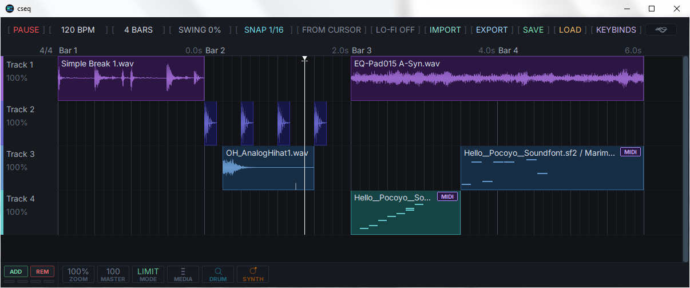

  

<h2 align="center">cseq</h2>

  multitrack sampler sequencer workstation (C99/Win32)

---

  

---

### input/output

| Signal | Description |
| :--- | :--- |
| **Audio Input** | `WAV`, `MP3`, `FLAC`, `OGG`, `M4A`, `AIFF`; SoundFont 2 (`.sf2`) in MIDI clips |
| **Audio Output** | `44.1 kHz` `Stereo` mixdown, `WAV` export (16‑bit & 24‑bit dithered, 32‑bit float) |

---

### controls

| Control | Description |
| :--- | :--- |
| **Timeline Canvas** | Drag clips to move; drag edges to trim/slip; drag handles to adjust fades; drag marquee to select multiple; right‑click for context menus |
| **Track Headers** | Click to mute; `Shift+Drag` to reorder; scroll wheel to adjust volume; right‑click for EQ, FX Rack, Pan/Width, Filter, and Granular dialogs |
| **Piano Roll** | Click to add/delete notes; drag to move/resize; scroll wheel to adjust velocity; ADSR knobs for amplitude envelope; right‑click for note‑specific options |
| **FX Rack** | Drag modules from the library onto the chain; drag to reorder; right‑click to remove; direct knob/slider manipulation |
| **Media Explorer** | Browse filesystem; click to preview (looped or one‑shot); drag a file to the canvas to import it at the cursor position |
| **Synth UI** | Drag knobs to edit voice parameters; click voice pads (Quadrum); select presets from dropdown (Halo); real‑time audition via piano roll |
| **Keybinds** | Press `K` or click the KEYBINDS button in the toolbar to view a complete list of keyboard shortcuts |

---

### features

| Component | Description |
| :--- | :--- |
| **Scale & Capacity** | 128 tracks, 1024 bars (up to 16 beats/bar), 2048 clips, 64 unique samples (shared across clips), 32 undo/redo states |
| **Sampling & Editing** | Zero‑copy slicing edits trim/split/duplicate clip metadata only, never the PCM buffer. Four fade curves (linear, exp, log, smooth), per‑clip volume & rate (0.01×–2.00×), slip editing, snap‑to‑grid quantisation |
| **MIDI & Sequencing** | Full piano roll with note‑by‑note velocity, length, and pitch editing. Built‑in **Generative Sequencer** for chord/arp patterns (root, scale, note count). **Humanize** tool for timing/duration/velocity randomisation. Per‑track **trigger probability** (0‑100%) for probabilistic playback |
| **Audio Engines** | **Granular** per clip/track (density, grain size, pitch jitter, pan spread, freeze/drone). **Quadrum**: 8‑voice procedural drum synth (Kick, Snare, Clap, Hats, etc.) with FM, noise, and filters. **Halo**: 8‑voice hybrid additive/FM poly synth with spectral tilt, unison, and chorus. **SoundFont 2** with preset browser and pre‑rendered note cache |
| **Mixing & FX** | Per‑track **3‑band parametric EQ** (sweepable frequency/Q, `±`12dB`). **Stackable filter plotter** (LP/HP/BP/Notch) with real‑time drag. **Modular FX rack**: Delay, Reverb, Compressor, Phaser, Chorus, Resonator, Lofi. Master **limiter/clipper** (switchable) and **Lo‑Fi** bus (bit depth 8‑12, sample rate 8‑32 kHz) |
| **UI & Workflow** | 120 FPS GDI pipeline with FNV hash‑tree dirty tracking for partial redraws. Content‑addressed PCM disk cache (FNV‑1a) deduplicates decoded audio. Media Explorer with loopable preview. Full **Undo/Redo** with atomic snapshots |
| **Project & Export** | Versioned trailing sections ensure forward/backward compatibility. Deterministic `WAV` export (16/24/32‑bit with TPDF dithering) using the exact same render loop as live playback. Export is bit‑for‑bit identical to what you hear |
| **Real‑Time Safety** | Audio callback is allocation‑free, I/O‑free, and GUI‑free. SIMD‑accelerated track summing (AVX2/SSE2). Denormal‑hardened (FTZ/DAZ). Heavy lifting (decode, save, export, peak‑build, SF2 pre‑render) runs on background workers, never stalls playback |
